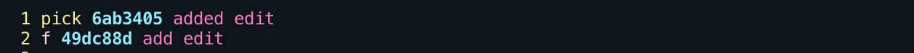
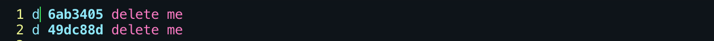

***
## ~/.gitconfig

> Configure username

``` php
$ git config --global user.name "[name]"
```

> Configure email

``` php
$ git config --global user.email "[email address]"
```

***
## Create New Repository
1. Create Repo on Github
2. `git init` on local directory
3. copy repo url (use the ssh)
4. `git remote add origin [repo url you copy on step 3]`
5. `git add .`
6. `git commit -m "your message"`
7. `git push origin master` (if got Permission Error try [this](https://github.com/vindecodex/gitguide/blob/master/fixPermisionError.md))
## Or Download Existing Repo
``` php
git clone [urlofrepo]
```
***
## Create branch and merging branch to the master
>You can create branch to create/upgrade/edit the existing file without affecting the main/master branch

```php
$ git branch branchname
```

>To enter to our new branch

```php
$ git checkout branchname
```

>You can checkout different branch created by anyone on your project

```php
$ git add .
$ git commit -m "Your message here"
$ git push origin branchname
```

>Adding new files in our branch

>After pushing to origin branchname a link will be given to the terminal, click it while pressing cmd on mac, i think ctrl for windows

>It will redirect to the pull request on github page

>Click Create pull request

```php
$ git checkout master
``` 

>To go back to the master branch

```php
$ git merge branchname
$ git push origin master
```

>To merge our changes on our branch to the master

>And push to our master to fully added to the main project

***

## Check for changes

```php
$ git status
```

>check if there is added, deleted or modified files so that you can start running the `git add` and `git commit`

```php
$ git diff
```

>to see changes of files that are not yet added by `git add .` to the master branch

```php
$ git diff branchA branchB
```

>to see changes between two branches

```php
$ git diff --staged
```

>to see changes of files that are already added by `git add .` to the master

>after you `git add .` those files are in staging or ready to be commited

```php
$ git reset filename
```

>to unstage the files but the contents of your current work will not be affected, it will just remove the added files for staging

```php
$ git log
```

>display all commited versions

```php
$ git log -1
```

>display only the last commit

## Rebase

>if you commited two times and the last commit just had a few changes and doesnt deserve to be commited then we can delete it without affecting the contents, only the commit will be removed but not its content or it will merge the last commit to the first commit

```php
$ git rebase -i HEAD~n //n here represents a number of how many commits will be modified
```

>if you want the commit will not be added but only its content we use this

>example we just commited for one time and push it to repo and then we update just a few code because got a wrong spelling then commit again, then its not really deserve to be commited.

```php
$ git rebase -i HEAD~2
```


```
yellow is the action
light blue is the commit code
pink is the commit message
```

>we want to merge committed A content to the add edit commit because A has just a few changes and it doesnt need to be commited



>**pick** is for the commited
>**f** is for **fixup**
>when using fixup you need HEAD~2 or greater than 2 because you need one commit to merge the other one, you cannot use fixup if only HEAD~1
>to edit the files is press **i**, and press **esc** to leave edit mode and press **:(shift ;)** then press **wq** for write quite

```php
$ git push origin master -f
```

>to push our changes to repo we need to add -f because we used rebase, remember always when using rebase you need to add -f when pushing



>**d** for **drop**
>this will delete the commited and also the contents entirely

```php
$ git push origin master -f
```

>if your branch is out of date or not the latest version from the origin master and to avoid build errors, ci errors, conflicts

```php
$ git fetch origin //fetch latest origin
$ git rebase origin/master
```

>now you are now top of the latest version!

***
# Git Add

>commit specific file

```php
$ git add [filename]
```

>commit all in a directory

```php
$ git add .
```

>commit everything included sub directories

```php
$ git add . -A
```

***

# Commit

>add to staging

```php
$ git commit -m "you message"
```

>add another file from previous commit/staging

```php
$ git add [file you want to add from previous commit]
$ git commit --amend
```

>it will prompt for a new commit message

***

# Fetching (Don't Care Local Changes)

> Be sure to stash all your local changes because it will be deleted when doing these.
> This will be a fresh files from repo (to avoid cloning again and again)

```php
$git fetch --all
$git reset --hard origin/master
```

***

# Stash

>git stash is to set aside what you are editing then go back to it later
>if you had edit something then want to reset but you want it to be save you need to use **stash**

```php
$ git stash
```

>now you stash you local modification

>and now you edit alot but want to go back from what you stash lately.

```php
$ git stash pop
```

>this will pop the latest stashed

>if you stashed alot you can use 

```php
$ git stash list
```

>to drop or delete a stash you can use

```php
$ git stash drop
```

>this will delete latest stashed

>to get the specific stash

```php
$ git stash pop stash@{n}
```

# Creating Alias

[Creating Aliases](https://github.com/vindecodex/bashrc)

# Passing Commits to another branch

```php
// on your branch that holds the commit you want to pass
$ git log
// copy the commit hash found
$ git checkout [branch that will copy the commit]
$ git reset --hard [hash of the commit you want to copy from the other branch]
// remove the [brackets]
```

***
>If you see some that needs improvements please help by creating a pull request. I also suggest play git **[here](https://learngitbranching.js.org/)**
***